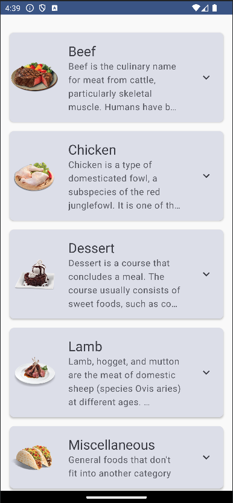

# MealsApp

A meals app project for learning Android's Jetpack Compose UI based on the [Udemy course](https://www.udemy.com/course/jetpack-compose-masterclass/). ⛳️

**Tools Used**

- Jetpack Compose UI
- Retrofit
- MVVM

You can fork this and start learning too.

Good luck

-- [Bhavin Desai](https://github.com/bddesai)
